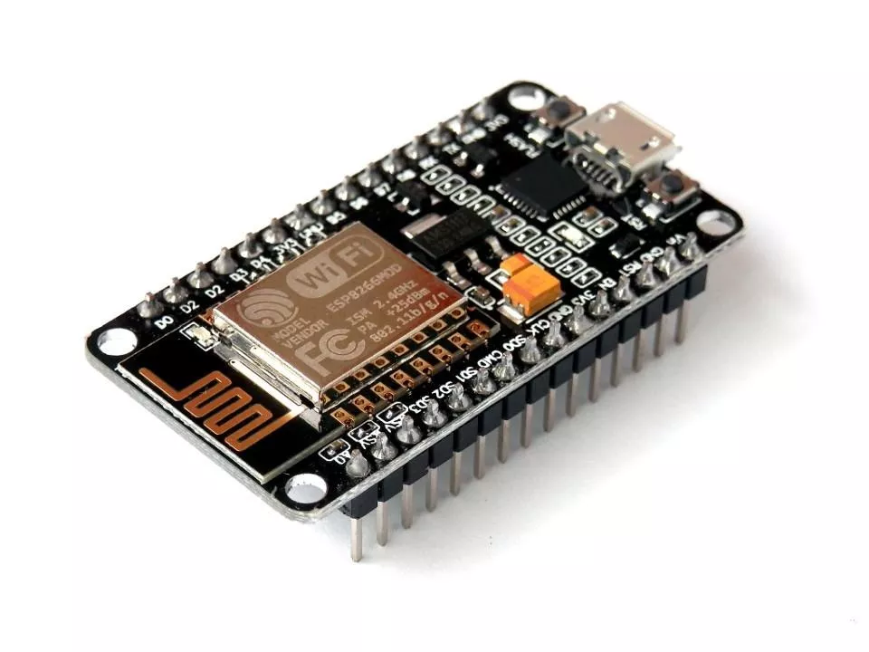
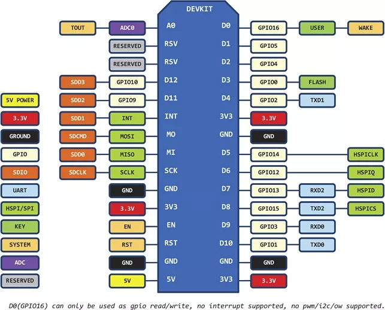
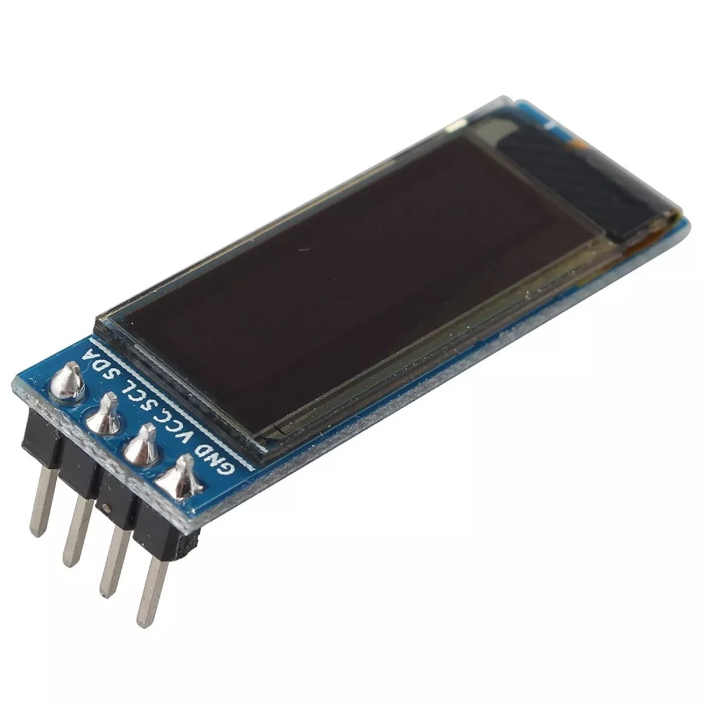
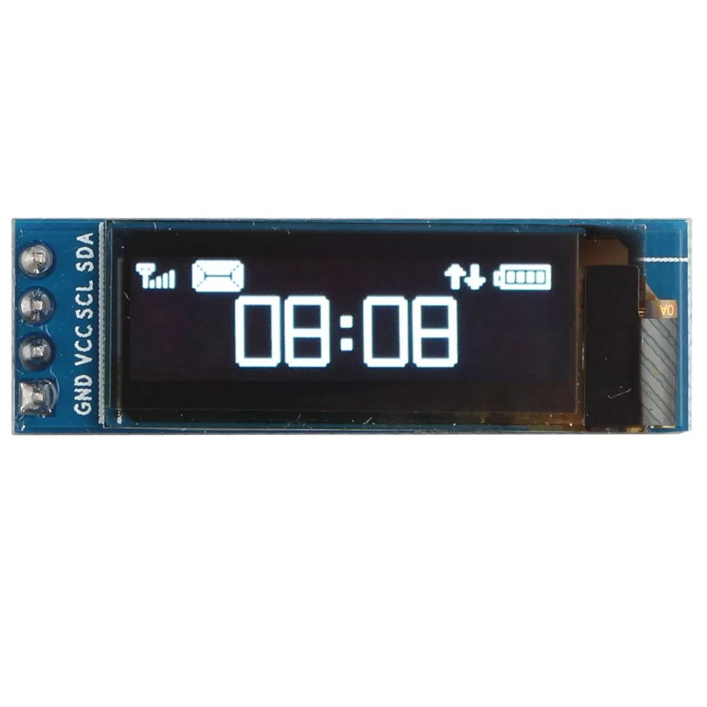

# ISS-Overhead-Check

Check International Space Station Pass Times Over 
Location using ESP8266 and [MicroPython](https://micropython.org/).

This project is created to run on my Nodemcu Wifi Esp8266 with Oled Display 128x32, can't test in others devices.

## Software Install

- Edit `boot.py` and update wifi credentials
- Edit `main.py` and change coords to your location.
- Upload both to controller

## Phisical Install

Connect pins from oled display in nodecmu using pins:

- D1: SCL
- D2: SDA
- GND and VCC can be pluged on 3.3 pin from board and GND.

## LICENSE

GPL3<Plug>(neosnippet_expand)

